# How Can a Wellness Technology Company Play It Smart?

## Table of Contents

- [Introduction](#introduction)
- [Business Objective](#business-objective)
- [Preparation of the Data](#preparation-of-the-data)
- [Processing the Daily Data](#processing-the-daily-data)
- [Analyzing the Daily Data](#analyzing-the-daily-data)
- [Processing the Hourly Data](#processing-the-hourly-data)
- [Analyzing the Hourly Data](#analyzing-the-hourly-data)
- [Deliverables and Recommendations](#deliverables-and-recommendations)
- Appendix
  - [Appendix - Code](#appendix---code)
  
Code is also available as .Rmd and .ipynb files.

## Introduction

[Back to the Top](#table-of-contents)

Bellabeat is a tech company that manufactures health products for women and wants to increase growth in the smart device market. The cofounders utilised one of their backgrounds as an artist to develop beautifully designed technology that informs and inspires women around the world.

The company has invested in traditional advertising media, such as radio, out-of-home billboards, print, and television, but focuses on digital marketing extensively. Bellabeat invests year-round in Google Search, maintaining active Facebook and Instagram pages, and consistently engages consumers on Twitter. Additionally, Bellabeat runs video ads on Youtube and display ads on the Google Display Network to support campaigns around key marketing dates.

The Bellabeat app provides users with health data related to their activity, sleep, stress, menstrual cycle, and mindfulness habits. This data can help users better understand their current habits and make healthy decisions. The Bellabeat app connects to their line of smart wellness products:
- **Leaf**: Bellabeat’s classic wellness tracker can be worn as a bracelet, necklace, or clip. The Leaf tracker connects to the Bellabeat app to track activity, sleep, and stress.
- **Time**: This wellness watch combines the timeless look of a classic timepiece with smart technology to track user activity, sleep, and stress. The Time watch connects to the Bellabeat app to provide you with insights into your daily wellness.
- **Spring**: This is a water bottle that tracks daily water intake using smart technology to ensure that you are appropriately hydrated throughout the day. The Spring bottle connects to the Bellabeat app to track your hydration levels.

Bellabeat also offers a subscription-based membership program for users. Membership gives users 24/7 access to fully personalized guidance on nutrition, activity, sleep, health and beauty, and mindfulness based on their lifestyle and goals.

The CCO believes that analyzing consumer data for the usage of non-Bellabeat smart devices will provide the insight needed to guide future marketing strategies for their own products

## Business Task

[Back to the Top](#table-of-contents)

Analyse trends in non-Bellabeat smart device usage and provide insight to inform the marketing strategies for one Bellabeat product and unlock new growth opportunities.

Key stakeholders:
- Urška Sršen: Bellabeat’s cofounder and Chief Creative Officer
- Sando Mur: Bellabeat’s cofounder
- Bellabeat marketing analytics team

## Preparation of the Data

[Back to the Top](#table-of-contents)

The [FitBit Fitness Tracker Data](https://www.kaggle.com/datasets/arashnic/fitbit) set from Kaggle was used:
- Accopmanying journal article available through [JMIR Publications](https://doi.org/10.2196/resprot.6513).
- This data set contains personal fitness data on thirty FitBit users.
  - Minute-level output for physical actiity, heart rate and sleep monitoring.
- The datasets were generated by respondents to a survey via Amazon Mechanical Turk between 2016-03-12 and 2016-05-12.
- It is available in the Public Domain (CC0).

### Limitations:

[Back to the Top](#table-of-contents)

Reliable:
- The sample size of the data is extremely small. A sample of n >= 30 is needed for the [Central Limit Theorem](https://sphweb.bumc.bu.edu/otlt/mph-modules/bs/bs704_probability/BS704_Probability12.html) to hold true. Most datasets actually contain 33 respondents, except for heartrate_seconds (14), minuteSleep (24), sleepDay (24) and WeightLogInfo (8).

Original:
- The data source is available, however, it is second party information and adjustments have been made.

Comprehensive:
- Many respondents did not upload data for each day or each hour. As a result, calculating measures such as the total steps taken each day by all respondents will skew the results toward the days that have more data entries made. This means that daily averages will be more accurate to use for comparisons.
- The data does not include details on gender, age, location, injuries, work hours, type of activities. Variables such as gender and age would have a large impact on the trend of data, but it can not be factored in or used to filter data. Bellabeat also specialises in products for women, so a collection of data that includes men will not be applicable.

Current:
- The data source is now over six years old. Smart devices are presumably now more accurate and collect more data. 

Cited:
- The data source is cited from a publication and available online.

Regardless, an analysis will be completed on the data.

## Introduction to the Data

[Back to the Top](#table-of-contents)

All data sets had 33 individuals, except for:
- heartrate_seconds = 14
- minuteSleep = 24
- sleepDay = 24
- WeightLogInfo = 8

## Processing the Daily Data

[Back to the Top](#table-of-contents)

* Columns were checked for NA values and duplicate rows.
* Daily sleep data contained 3 duplicates that were removed.
* The column names were cleaned
* New columns were added to include the week day, date (in a date format), and id_and_date (to use for joins).
* The daily activity, daily sleep and daily weight data sets were joined together.

## Analyzing the Daily Data

[Back to the Top](#table-of-contents)

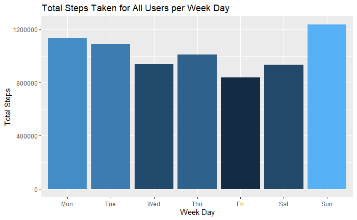

At face value, users collectively walked the most steps on Sundays. This data is misleading, however, as data entries were not made consistently between week days.

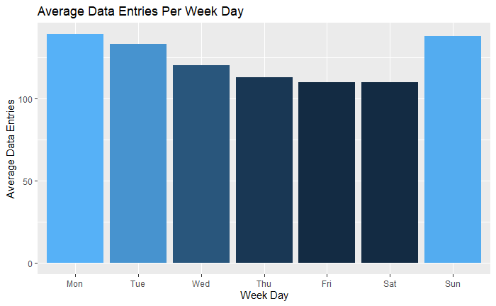

To counter this, averages will need to be used for each week day.

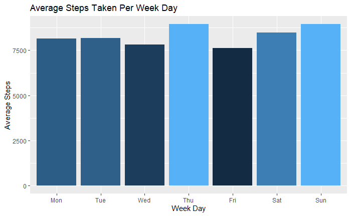

Surprisingly, Thursdays seem to have the largest average numbers of steps taken, followed by the weekend.

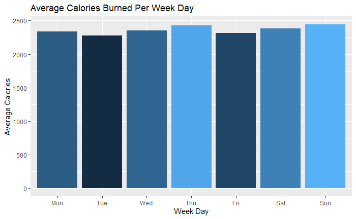

Thursdays, again, appear to be the day with the highest average calories burned, followed by Sundays.

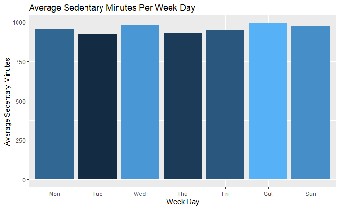

It appears Wednesdays, Saturdays and Sundays have the highest average number of sedentary minutes. It may be that workdays generally involved more walking, so the weekends have a higher number of sedentary minutes, but will have a higher number of fairly active and very active minutes. For each day, participants spent, on average, at least 13 hours experiencing sedentary minutes.

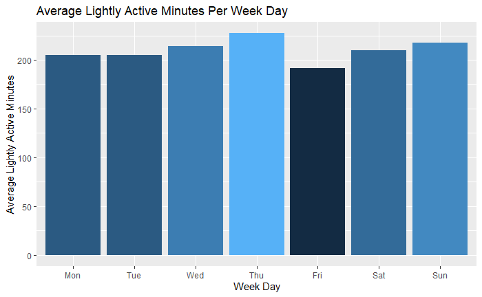

Thursdays appear to be the day with the highest average lightly active minutes, followed by Sundays.


Thursdays, Fridays, Saturdays and Sundays have more fairly active minutes that the start of the week, on average.

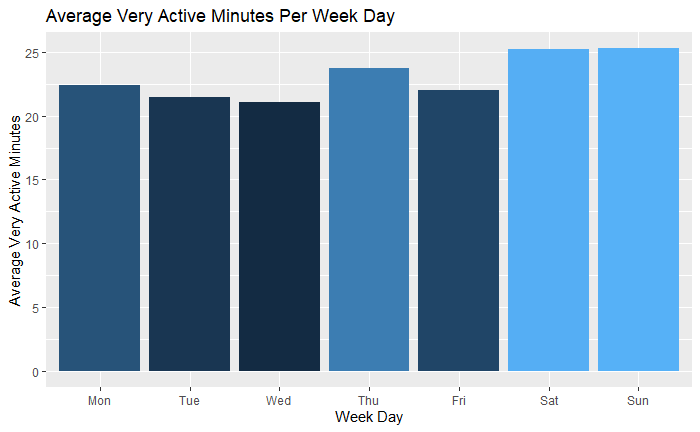

Saturdays and Sundays have the greatest average number of very active minutes. This data includes a lot of records of "0" very active minutes. The following graph shows this data with "0" very active minute records filtered out.

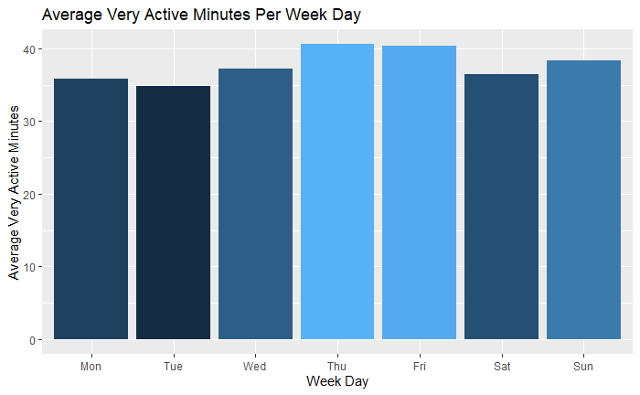

With "0" records of very active minutes filtered, out, Thursdays and Fridays have the highest average very active minutes.


As the number of total steps per day increases, the number of calories burned also increases. At the 10,000 step recommendation by the [CDC](https://www.cdc.gov/diabetes/prevention/pdf/postcurriculum_session8.pdf), indivudals burn approximately 2,500 calories per day.

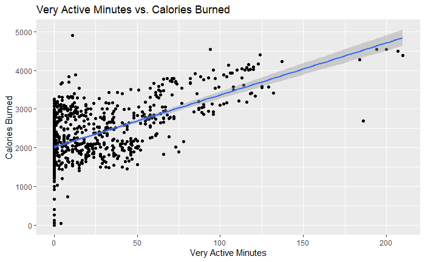

Participants appear to spend most days experiencing less than an hour of very active minutes. Individuals needed to spend approximately 35 minutes in a very active state to reach 2,500 daily calories burned.

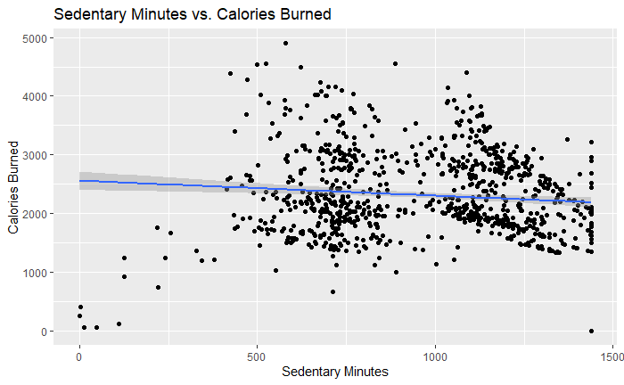

The more minutes spent sedentary per day, the fewer calories burned. 

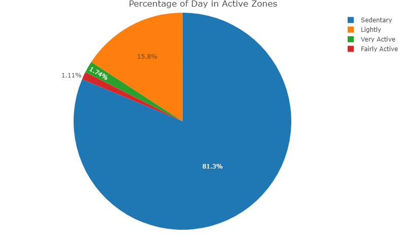

Participants spent, on average, 81.3% of the time in a sedentary position.

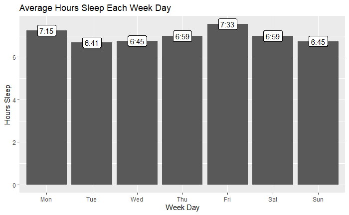

Participants spent less than eight hours asleep each day, and less than 7 hours asleep on five days.

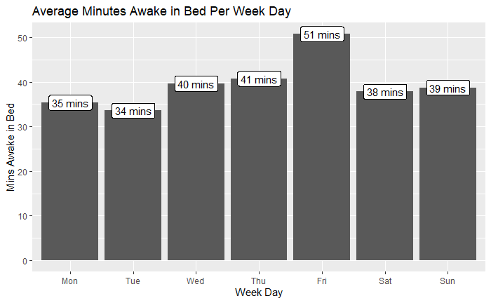

Participants spend, on average, over 30 minutes in bed and awake daily.

## Processing the Hourly Data

[Back to the Top](#table-of-contents)

* Columns were checked for NA values and duplicate rows.
* The column names were cleaned
* New columns were added to include the week day, date (in a date format), hour, and id_and_time (to use for joins).
* The hourly steps, hourly intensities and hourly calories data sets were joined together. 

## Analyzing the Hourly Data

[Back to the Top](#table-of-contents)

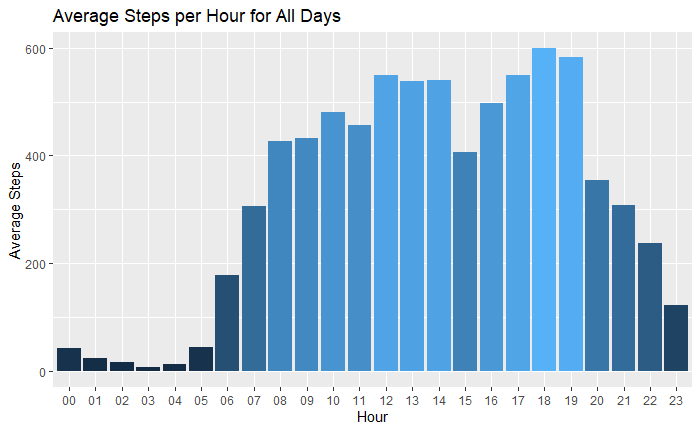

Participants were most active beteween 7:00 amd and 7:00 pm.

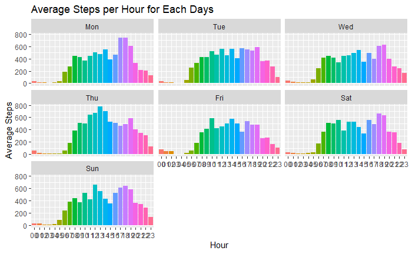

Monday evenings and Thursdays appear to have unusual spikes in hourly activity.

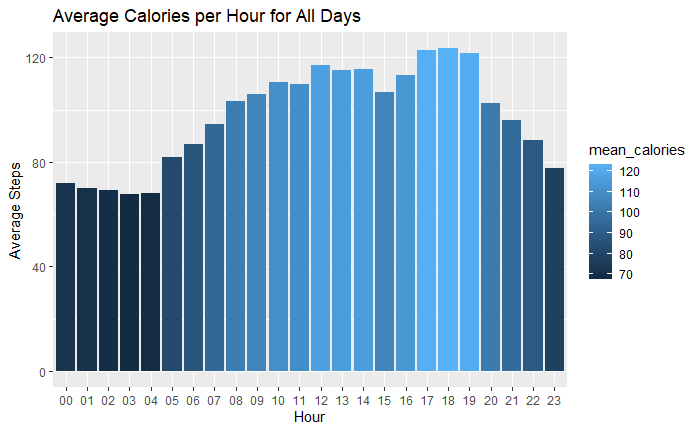

Participants burned the most calories between 5:00 pm and 8:00 pm.


Monday evenings and Thursdays appear to have unusual spikes in the amount of calories burned.

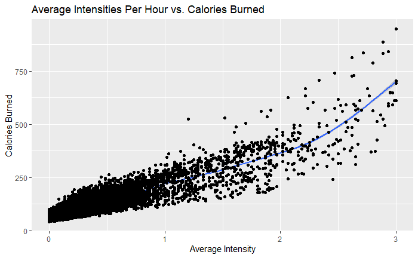

The relationships between average intensity and caloried burned per hour is fairly linear until the average intensity reaches approximately 2.25, then the calories burned increases disproportionately.

## Deliverables and Recommendations

- The [CDC recommends](https://www.cdc.gov/diabetes/prevention/pdf/postcurriculum_session8.pdf) that most adults should reach a daily step count of 10,000. This data shows that, on average, adults are not reaching this benchmark.

- The [WHO recommends](https://www.who.int/news-room/fact-sheets/detail/physical-activity) that adults 18-64 years of age should do at least 150–300 minutes of moderate-intensity aerobic physical activity or at least 75–150 minutes of vigorous-intensity aerobic physical activity. Participants spent less than an hour, on average, each day experiencing very active minutes.

- The [CDC recommends](https://www.cdc.gov/sleep/about_sleep/how_much_sleep.html) that adults 18-60 years of age should sleep for 7 or more hours per night. The data shows that on most days, individuals are not getting the recommended number of hours sleep.

- Users track their activities early in the week, then make fewer entries until the weekend.

- More accurate data is needed. It is recommended that Bellabeat find new data sources with more participants, consistent data entry and a greater number of variables to analyse, particularly to identify trends in females.

- Products could notify users on how close their are to their 10,000 step goal, how close they are to their very active minutes goal, and how much sleep they got the night before.

- Bellabeat could integrate a social aspect to allows users to encourage each other.

- Data could sync automatically and remove some responsibility from the users, to provide more accurate recommendations.

- Advertising could refer to how much sleep people are getting/should get, how many minutes people are spending active/should be, and how many calories the average adult should aim to burn a day/how to achieve it.

## Appendix - Code

### Setup

Install and load the required packages.
```
install.packages("dplyr")
install.packages("tidyr")
install.packages("ggplot2")
install.packages("lubridate")
install.packages("readr")
install.packages("janitor")
install.packages("styler")
install.packages("plotly")
library(dplyr)
library(tidyr)
library(ggplot2)
library(lubridate)
library(readr)
library(janitor)
library(styler)
library(plotly)
```

Create a list of csv files in the directory.
```
files_csv <- list.files(path = "bellabeat_data/", pattern = "*.csv")
```

Create a list of file names for the data frames.
```
files <- substr(files_csv,1,nchar(files_csv)-4)
```

Create data frames for all the csv files.
```
for(i in files){
  filepath = file.path(paste("bellabeat_data/",i,".csv", sep = ""))
  assign(i,read_csv(filepath))
}
```

Count the distinct IDs in each data frame to determine how many individuals there were for each data set.
```
n_distinct(dailyActivity_merged$Id)
n_distinct(dailyCalories_merged$Id)
n_distinct(dailyIntensities_merged$Id)
n_distinct(dailySteps_merged$Id)
n_distinct(heartrate_seconds_merged$Id)
n_distinct(hourlyCalories_merged$Id)
n_distinct(hourlyIntensities_merged$Id)
n_distinct(hourlySteps_merged$Id)
n_distinct(minuteCaloriesNarrow_merged$Id)
n_distinct(minuteCaloriesWide_merged$Id)
n_distinct(minuteIntensitiesNarrow_merged$Id)
n_distinct(minuteIntensitiesWide_merged$Id)
n_distinct(minuteMETsNarrow_merged$Id)
n_distinct(minuteSleep_merged$Id)
n_distinct(minuteStepsNarrow_merged$Id)
n_distinct(minuteStepsWide_merged$Id)
n_distinct(sleepDay_merged$Id)
n_distinct(weightLogInfo_merged$Id)
```

All data sets had 33 individuals, except for:
- heartrate_seconds = 14
- minuteSleep = 24
- sleepDay = 24
- WeightLogInfo = 8

### Processing the Daily Activity Data

Determine how the data is structured.
```
str(dailyActivity_merged)
```

Check for NA values and duplicate rows.
```
sum(is.na(dailyActivity_merged))
sum(duplicated(dailyActivity_merged))
```

Clean the column names.
```
dailyActivity_merged <- clean_names(dailyActivity_merged)
glimpse(dailyActivity_merged)
```

Add a new date column in appropriate format, column for day of the week (with Monday being designated as the first day) and an "id_and_date" to use as reference for joins later.
```
dailyActivity_merged <- dailyActivity_merged %>%
  mutate(
    new_date = as.Date(activity_date,"%m/%d/%y"),
    week_day = wday(new_date,label=TRUE,week_start=1),
    id_and_date = paste0(id,"_and_",new_date)
  )
str(dailyActivity_merged)
```

### Processing the Daily Sleep Data

Determine how the data is structured.
```
str(sleepDay_merged)
```

Check for NA values and duplicate rows.
```
sum(is.na(sleepDay_merged))
sum(duplicated(sleepDay_merged))
```

Remove duplicates.
```
sleepDay_merged <- sleepDay_merged[!duplicated(sleepDay_merged),]
sum(duplicated(sleepDay_merged))
```

Clean the column names.
```
sleepDay_merged <- clean_names(sleepDay_merged)
str(sleepDay_merged)
```

Add a new column for time awake in bed, a new date column in appropriate format, column for day of the week (with Monday being designated as the first day) and an "id_and_date" to use as reference for joins later.
```
sleepDay_merged <- sleepDay_merged %>%
  mutate(
    time_awake_in_bed = total_time_in_bed - total_minutes_asleep,
    new_date = as.Date(sleep_day,"%m/%d/%y"),
    week_day = wday(new_date,label=TRUE,week_start=1),
    id_and_date = paste0(id,"_and_",new_date)
  )
str(sleepDay_merged)
```

### Processing the Daily Weight Data

Determine how the data is structured.
```
str(weightLogInfo_merged)
```

Check for NA values and duplicate rows.
```
sum(is.na(weightLogInfo_merged))
sum(duplicated(weightLogInfo_merged))
```

NA values exist - double check what they actually are.
```
head(weightLogInfo_merged)
```
They are just 'Fat' records that weren't put in, but other daily data exists for these dates and, if we need, we can filter out these NA vales if we analyse Fat data.

Clean the column names.
```
weightLogInfo_merged <- clean_names(weightLogInfo_merged)
str(weightLogInfo_merged)
```

Add a new date column in appropriate format, column for day of the week and an "id_and_date" to use as reference for joins later.
```
weightLogInfo_merged <- weightLogInfo_merged %>%
  mutate(
    new_date = as.Date(date,"%m/%d/%y"),
    week_day = wday(new_date,label=TRUE),
    id_and_date = paste0(id,"_and_",new_date)
  )
str(weightLogInfo_merged)
```

### Creating temp tables for joining

Daily Activity Data.
```
colnames(dailyActivity_merged)
```
```
temp_daily_activity <- select(dailyActivity_merged, 
  "id", 
  "new_date",
  "id_and_date",
  "total_steps", 
  "total_distance", 
  "very_active_distance",
  "moderately_active_distance",
  "light_active_distance",
  "sedentary_active_distance",
  "very_active_minutes",
  "fairly_active_minutes",
  "lightly_active_minutes",
  "sedentary_minutes",
  "calories", 
  "week_day"
  )
```

Daily Sleep Data.
```
colnames(sleepDay_merged)
```
```
temp_daily_sleep <- select(sleepDay_merged, 
  "id_and_date",
  "total_sleep_records",
  "time_awake_in_bed",
  "total_minutes_asleep",
  "total_time_in_bed",
  )
```

Merge these two data frames with an outer join.
```
merged_daily_activity_and_sleep <- merge(x = temp_daily_activity, y = temp_daily_sleep, by = "id_and_date", all = TRUE)
str(merged_daily_activity_and_sleep)
```

Daily Weight Data.
```
colnames(weightLogInfo_merged)
```
```
temp_daily_weight <- select(weightLogInfo_merged, 
  "id_and_date",
  "weight_kg",
  "weight_pounds",
  "fat",
  "bmi",
  "is_manual_report",
  )
colnames(temp_daily_weight)
```

Merge all data together.
```
merged_data_daily <- merge(x = merged_daily_activity_and_sleep, y = temp_daily_weight, by = "id_and_date", all = TRUE)
str(merged_data_daily)
glimpse(merged_data_daily)
```

### Analysing the Daily Data

Create a data frame of averages to analyse step data and intensity of distances and minutes.
```
merged_data_daily_averages <- merged_data_daily %>%
  ## remove records where no steps were taken (no device usage)
  filter(total_steps > 0) %>%
  group_by(week_day) %>%
    summarise(
      mean_steps = mean(total_steps),
      mean_total_distance = mean(total_distance),
      mean_very_active_distance = mean(very_active_distance),
      mean_moderately_active_distance = mean(moderately_active_distance),
      mean_light_active_distance = mean(light_active_distance),
      mean_sedentary_active_distance = mean(sedentary_active_distance),
      mean_very_active_minutes = mean(very_active_minutes),
      mean_fairly_active_minutes = mean(fairly_active_minutes),
      mean_lightly_active_minutes = mean(lightly_active_minutes),
      mean_sedentary_minutes = mean(sedentary_minutes),
      mean_calories = mean(calories),
      total_records = sum(!is.na(week_day))
    )
glimpse(merged_data_daily_averages)
```

Create a graph of total steps for all users per week day.
```
all_steps_daily <- merged_data_daily %>%
  group_by(week_day) %>%
  summarise(
    all_steps = sum(total_steps)
  )
ggplot(data=all_steps_daily,aes(x=week_day,y=all_steps,fill=all_steps)) + geom_col() + geom_col() + labs(title="Total Steps Taken for All Users per Week Day", x="Week Day", y="Total Steps") + guides(fill="none")
```

Create a graph of average steps per week day.
```
ggplot(data=merged_data_daily_averages, aes(x=week_day,y=mean_steps,fill=mean_steps)) + geom_col() + labs(title="Average Steps Taken Per Week Day", x="Week Day", y="Average Steps") + guides(fill="none")
```

Create a graph of average calories per week day.
```
ggplot(data=merged_data_daily_averages, aes(x=week_day,y=mean_calories,fill=mean_calories)) + geom_col() + labs(title="Average Calories Burned Per Week Day", x="Week Day", y="Average Calories") + guides(fill="none")
```

Create a graph of average records per week day.
```
ggplot(data=merged_data_daily_averages, aes(x=week_day,y=total_records,fill=total_records)) + geom_col() + labs(title="Average Data Entries Per Week Day", x="Week Day", y="Average Data Entries") + guides(fill="none")
```

Create a graph of average sedentary minutes per week day.
```
average_sedentary_daily <- merged_data_daily %>%
filter(total_steps > 0) %>%
  group_by(week_day) %>%
  summarise(
    mean_sed_mins = mean(sedentary_minutes)
  )

ggplot(data=average_sedentary_daily, aes(x=week_day,y=mean_sed_mins,fill=mean_sed_mins)) + geom_col() + labs(title="Average Sedentary Minutes Per Week Day", x="Week Day", y="Average Sedentary Minutes") + guides(fill="none")
```

Create a graph of average lightly active minutes per week day.
```
average_lightly_active_daily <- merged_data_daily %>%
filter(total_steps > 0) %>%
  group_by(week_day) %>%
  summarise(
    mean_la_mins = mean(lightly_active_minutes)
  )

ggplot(data=average_lightly_active_daily, aes(x=week_day,y=mean_la_mins,fill=mean_la_mins)) + geom_col() + labs(title="Average Lightly Active Minutes Per Week Day", x="Week Day", y="Average Lightly Active Minutes") + guides(fill="none")
```

Create a graph of average fairly active minutes per week day.
```
average_fairly_active_daily <- merged_data_daily %>%
filter(total_steps > 0) %>%
  group_by(week_day) %>%
  summarise(
    mean_fa_mins = mean(fairly_active_minutes)
  )

ggplot(data=average_fairly_active_daily, aes(x=week_day,y=mean_fa_mins,fill=mean_fa_mins)) + geom_col() + labs(title="Average Fairly Active Minutes Per Week Day", x="Week Day", y="Average Fairly Active Minutes") + guides(fill="none")
```

Create a graph of average very active minutes per week day.
```
average_very_active_daily <- merged_data_daily %>%
filter(total_steps > 0) %>%
  group_by(week_day) %>%
  summarise(
    mean_va_mins = mean(very_active_minutes)
  )

ggplot(data=average_very_active_daily, aes(x=week_day,y=mean_va_mins,fill=mean_va_mins)) + geom_col() + labs(title="Average Very Active Minutes Per Week Day", x="Week Day", y="Average Very Active Minutes") + guides(fill="none")
```

Create a graph of average very active minutes per week day with very_active_minutes > 0 to remove potentially incomplete records.
```
average_very_active_daily <- merged_data_daily %>%
filter(total_steps > 0) %>%
  filter(very_active_minutes > 0) %>%
  group_by(week_day) %>%
  summarise(
    mean_va_mins = mean(very_active_minutes)
  )

ggplot(data=average_very_active_daily, aes(x=week_day,y=mean_va_mins,fill=mean_va_mins)) + geom_col() + labs(title="Average Very Active Minutes Per Week Day", x="Week Day", y="Average Very Active Minutes") + guides(fill="none")
```

Create a graph of daily steps vs. daily calories burned.
```
daily_steps_vs_calories <- merged_data_daily %>%
  summarise (
    total_steps = total_steps,
    calories = calories
  )
ggplot(data=daily_steps_vs_calories, aes(x=total_steps,y=calories)) + geom_smooth(method = lm, aes(x=total_steps,y=calories)) + geom_point() + labs(title="Total Steps taken vs. Calories Burned Per Day", x="Total Steps", y="Calories Burned")
```

Create a graph of very active minutes vs. daily calories burned.
```
very_active_calories <- merged_data_daily %>%
summarise (
    very_active_minutes = very_active_minutes,
    calories = calories    
    )
ggplot(data=very_active_calories, aes(x=very_active_minutes,y=calories)) + geom_point() + geom_smooth(method=lm, aes(x=very_active_minutes,y=calories)) + labs(title="Very Active Minutes vs. Calories Burned", x="Very Active Minutes",y="Calories Burned")
```

Create a graph of sedentary minutes vs. daily calories burned.
```
sedentary_calories <- merged_data_daily %>%
summarise (
    sedentary_minutes = sedentary_minutes,
    calories = calories    
    )
ggplot(data=sedentary_calories, aes(x=sedentary_minutes,y=calories)) + geom_point() + geom_smooth(method=lm, aes(x=sedentary_minutes,y=calories)) + labs(title="Sedentary Minutes vs. Calories Burned", x="Sedentary Minutes",y="Calories Burned")
```

Create a pie chart of percentage per day in each active zone.
```
active_minutes_summary <- merged_data_daily %>%
  summarise(
  sedentary_minutes = mean(sedentary_minutes),
  lightly_active_minutes = mean(lightly_active_minutes),
  fairly_active_minutes = mean(fairly_active_minutes),
  very_active_minutes = mean(very_active_minutes),
)

percentage <- data.frame(
  levels = c(
    "Sedentary",
    "Lightly",
    "Fairly Active",
    "Very Active"),
  percentage = c(
    active_minutes_summary$sedentary_minutes, 
    active_minutes_summary$lightly_active_minutes, 
    active_minutes_summary$fairly_active_minutes, 
    active_minutes_summary$very_active_minutes)
)

plot_ly(percentage, labels = ~levels, values = ~percentage, type = 'pie') %>%
  layout(title="Percentage of Day in Active Zones")
```

Create a data frame of averages to analyse sleep data, including time in bed not asleep.
```
merged_data_daily_sleep_averages <- merged_data_daily %>%
  ## remove records where no sleep record was made
  filter(total_sleep_records > 0) %>%
  group_by(week_day) %>%
    summarise(
      mean_time_awake_in_bed = mean(time_awake_in_bed),
      mean_total_minutes_asleep = mean(total_minutes_asleep),
      mean_total_time_in_bed = mean(total_time_in_bed),
      total_records = sum(!is.na(week_day))
    )
glimpse(merged_data_daily_sleep_averages)
```

Create a graph of average minutes asleep each week day.
```
merged_data_daily_sleep_averages_labelled <- merged_data_daily %>%
  ## remove records where no sleep record was made (no device usage)
  filter(total_sleep_records > 0) %>%
  group_by(week_day) %>%
  summarise(
    mean_total_minutes_asleep = mean(total_minutes_asleep),
    hours = (mean_total_minutes_asleep/60),
    floorhours = floor(hours),
    sumhours = round(hours %% floorhours * 60,0 ),
    label = paste0(floorhours,":",sumhours)
  )
ggplot(data=merged_data_daily_sleep_averages_labelled, aes(x=week_day,y=hours,label = label)) + geom_col() + geom_label(position = position_dodge(width = 1)) + xlab(label = "Week Day") + ylab(label = "Hours Sleep") + ggtitle(label = "Average Hours Sleep Each Week Day")
```


Create a graph of average time in bed and awake each week day.
```
merged_data_daily_bed_awake_averages_labelled <- merged_data_daily %>%
  ## remove records where no sleep record was made (no device usage)
  filter(total_sleep_records > 0) %>%
  group_by(week_day) %>%
  summarise(
    mean_time_awake_in_bed = mean(time_awake_in_bed),
    label = paste0(round(mean_time_awake_in_bed)," mins")
  )
ggplot(data=merged_data_daily_bed_awake_averages_labelled, aes(x=week_day,y=mean_time_awake_in_bed,label = label)) + geom_col() + geom_label(position = position_dodge(width = 1)) + xlab(label = "Week Day") + ylab(label = "Mins Awake in Bed") + ggtitle(label = "Average Minutes Awake in Bed Per Week Day")
```

### Processing the Hourly Steps Data

Determine how the data is structured.
```
str(hourlySteps_merged)
```

Check for NA values and duplicate rows.
```
sum(is.na(hourlySteps_merged))
sum(duplicated(hourlySteps_merged))
```

Clean the column names.
```
hourlySteps_merged <- clean_names(hourlySteps_merged)
str(hourlySteps_merged)
```

Add columns for the date, the hour(and ways to represent it) and id/date/hour for joins later.
```
hourlySteps_merged <- hourlySteps_merged %>%
  mutate(
    new_date = as.Date(activity_hour,"%m/%d/%y"),
    new_hour = format(mdy_hms(activity_hour),format="%H:%M"),
    hour_int = hour(mdy_hms(activity_hour)),
    hour_label = format(mdy_hms(activity_hour),format="%H%p"),
    hour_label_simple = format(mdy_hms(activity_hour),format="%H"),
    week_day = wday(new_date,label=TRUE,week_start=1),
    id_and_time = paste0(id,"_and_",new_date,"_and_",new_hour)
  )
str(hourlySteps_merged)
```

### Processing the Hourly Intensities Data

Determine how the data is structured.
```
str(hourlyIntensities_merged)
```

Check for NA values and duplicate rows.
```
sum(is.na(hourlyIntensities_merged))
sum(duplicated(hourlyIntensities_merged))
```

Clean the column names.
```
hourlyIntensities_merged <- clean_names(hourlyIntensities_merged)
str(hourlyIntensities_merged)
```

Add columns for the date, the hour and id/date/hour for joins later.
```
hourlyIntensities_merged <- hourlyIntensities_merged %>%
  mutate(
    new_date = as.Date(activity_hour,"%m/%d/%y"),
    new_hour = format(mdy_hms(activity_hour),format="%H:%M"),
    week_day = wday(new_date,label=TRUE,week_start=1),
    id_and_time = paste0(id,"_and_",new_date,"_and_",new_hour)
  )
str(hourlyIntensities_merged)
```

### Processing the Hourly Calories Data

Determine how the data is structured.
```
str(hourlyCalories_merged)
```

Check for NA values and duplicate rows.
```
sum(is.na(hourlyCalories_merged))
sum(duplicated(hourlyCalories_merged))
```

Clean the column names.
```
hourlyCalories_merged <- clean_names(hourlyCalories_merged)
str(hourlyCalories_merged)
```

Add columns for the date, the hour and id/date/hour for joins later.
```
hourlyCalories_merged <- hourlyCalories_merged %>%
  mutate(
    new_date = as.Date(activity_hour,"%m/%d/%y"),
    new_hour = format(mdy_hms(activity_hour),format="%H:%M"),
    week_day = wday(new_date,label=TRUE),
    id_and_time = paste0(id,"_and_",new_date,"_and_",new_hour)
  )
str(hourlyCalories_merged)
```

### Creating temp tables for joining

Hourly Steps Data.
```
colnames(hourlySteps_merged)
```
```
temp_hourly_steps <- select(hourlySteps_merged, 
  "id", 
  "activity_hour",
  "id_and_time",
  "new_date",
  "new_hour",
  "hour_int",
  "hour_label",
  "hour_label_simple",
  "week_day",
  "step_total"
  )
```

Hourly Intensities Data.
```
colnames(hourlyIntensities_merged)
```
```
temp_hourly_intensities <- select(hourlyIntensities_merged, 
  "id_and_time",
  "total_intensity",
  "average_intensity"
  )
```

Merge these two data frames with an outer join.
```
merged_hourly_steps_and_intensities <- merge(x = temp_hourly_steps, y = temp_hourly_intensities, by = "id_and_time", all = TRUE)
str(merged_hourly_steps_and_intensities)
```

Hourly Calories Data.
```
colnames(hourlyCalories_merged)
```
```
temp_hourly_calories <- select(hourlyCalories_merged, 
  "id_and_time",
  "calories"
  )
colnames(temp_hourly_calories)
```

Merge all data together.
```
merged_data_hourly <- merge(x = merged_hourly_steps_and_intensities, y = temp_hourly_calories, by = "id_and_time", all = TRUE)
str(merged_data_hourly)
glimpse(merged_data_hourly)
```

### Analysing the Hourly Data

Create a graph of average steps per hour for all days.
```
merged_data_hourly_averages <- merged_data_hourly %>%
  group_by(hour_label_simple) %>%
  summarise (
    mean_step_total = mean(step_total),
  ) 
glimpse(merged_data_hourly_averages)
ggplot(data=merged_data_hourly_averages, aes(x=hour_label_simple, y=mean_step_total, fill=mean_step_total)) + geom_col() + xlab(label = "Hour") + ylab(label = "Average Steps") + ggtitle(label = "Average Steps per Hour for All Days") + guides(fill="none")
```

Create graphs of average steps per hour for each week day.
```
merged_data_hourly_averages <- merged_data_hourly %>%
  group_by(week_day, hour_label_simple) %>%
  summarise (
    mean_step_total = mean(step_total),
  ) 
glimpse(merged_data_hourly_averages)
ggplot(data=merged_data_hourly_averages, aes(x=hour_label_simple, y=mean_step_total, fill=hour_label_simple)) + geom_col() + xlab(label = "Hour") + ylab(label = "Average Steps") + ggtitle(label = "Average Steps per Hour for Each Days") + facet_wrap(~week_day) + guides(fill="none")
```

Create a graph of average calories burned per hour for all days.
```
hourly_calories <- merged_data_hourly %>%
  group_by(hour_label_simple) %>%
  summarise (
    mean_calories = mean(calories),
  ) 

glimpse(hourly_calories)

ggplot(data=hourly_calories, aes(x=hour_label_simple, y=mean_calories,fill=mean_calories)) + geom_col() + xlab(label = "Hour") + ylab(label = "Average Steps") + ggtitle(label = "Average Calories per Hour for All Days")
```

Create graphs of average calories burned per hour for each week day.
```
hourly_calories <- merged_data_hourly %>%
  group_by(week_day, hour_label_simple) %>%
  summarise (
    mean_calories = mean(calories),
  ) 

glimpse(hourly_calories)

ggplot(data=hourly_calories, aes(x=hour_label_simple, y=mean_calories,fill=mean_calories)) + geom_col() + facet_wrap(~week_day) + xlab(label = "Hour") + ylab(label = "Average Steps") + ggtitle(label = "Average Calories per Hour for All Days")
```

Create a graph of average intensity per hour vs. calories burned per hour.
```
average_vs_cal <- merged_data_hourly %>%
  summarise (
    average_intensity = average_intensity,
      calories = calories
  ) 

ggplot(data=average_vs_cal, aes(x=average_intensity, y=calories)) + geom_smooth(aes(x=average_intensity, y=calories)) + geom_point() + xlab(label = "Average Intensity") + ylab(label = "Calories Burned") + ggtitle(label = "Average Intensities Per Hour vs. Calories Burned")
```